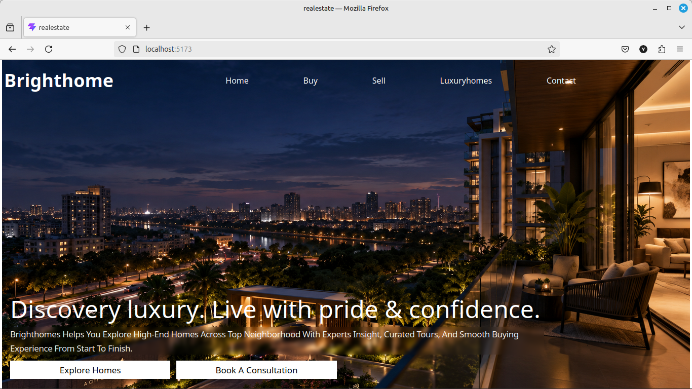
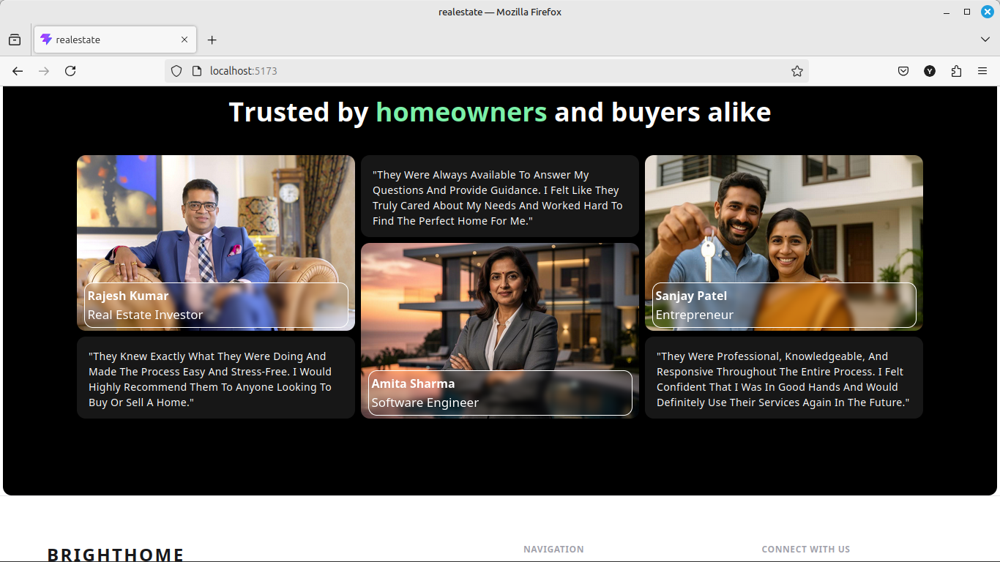
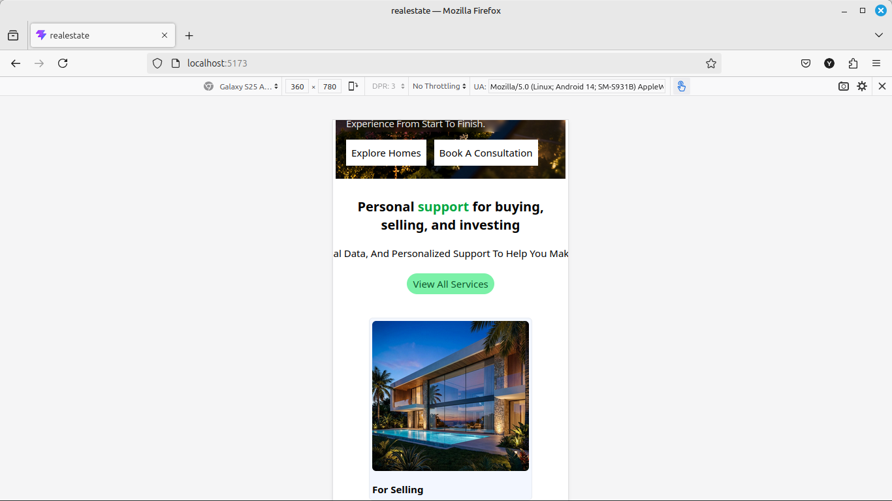

# 🏡 Dweller — Real Estate Website

**Dweller** is a modern, premium real estate website designed to showcase properties with a clean visual experience, smooth animations, and responsive layouts.

The project focuses on creating a polished real-estate browsing experience suitable for property businesses, agencies, and real estate professionals.

## 🔗 Quick Access

* 🌐 **Live Demo:** [Dweller](https://dweller-realestate.vercel.app/)
* 💻 **GitHub Repository:** [TrainedDev/Dweller](https://github.com/TrainedDev/Dweller)

> **Note:** If the live deployment URL changes, update the Live Demo link above.

---

## 📸 Screenshots

### Hero Section



### Client / Testimonial Section



### Responsive Design



---

## ✨ Features

* 🏠 Premium real estate landing page
* 🔎 Property-focused sections and content
* 📱 Fully responsive design
* 🎬 Smooth scrolling experience with Lenis
* ✨ GSAP-powered animations and transitions
* 🧭 Multi-page navigation with React Router
* 🎨 Modern UI built with Tailwind CSS
* 📐 Responsive layouts optimized for desktop, tablet, and mobile
* ⚡ Fast development and production builds with Vite
* 🖱️ Interactive UI elements and visual transitions

---

## 🛠️ Tech Stack

| Technology       | Purpose                                |
| ---------------- | -------------------------------------- |
| **React**        | UI development                         |
| **Vite**         | Development environment and build tool |
| **Tailwind CSS** | Styling and responsive layouts         |
| **GSAP**         | Advanced animations                    |
| **Lenis**        | Smooth scrolling                       |
| **React Router** | Client-side routing                    |
| **Lucide React** | UI icons                               |
| **ESLint**       | Code quality and linting               |

---

## 📁 Project Structure

```text
Dweller/
│
├── public/
│
├── screenshots/
│   ├── real_estate_hero.png
│   ├── real_estate_client.png
│   └── realestate_responsive.png
│
├── src/
│   ├── components/
│   ├── pages/
│   ├── assets/
│   └── ...
│
├── .gitignore
├── eslint.config.js
├── index.html
├── package.json
├── package-lock.json
├── vite.config.js
└── README.md
```

---

## 🚀 Getting Started

### 1. Clone the repository

```bash
git clone https://github.com/TrainedDev/Dweller.git
```

### 2. Navigate to the project

```bash
cd Dweller
```

### 3. Install dependencies

```bash
npm install
```

### 4. Start the development server

```bash
npm run dev
```

The application will be available at the local URL provided by Vite, typically:

```text
http://localhost:5173
```

---

## 📦 Available Scripts

### Development

```bash
npm run dev
```

Starts the Vite development server with hot module replacement.

### Production Build

```bash
npm run build
```

Creates an optimized production build.

### Preview Production Build

```bash
npm run preview
```

Runs the production build locally for preview.

### Lint

```bash
npm run lint
```

Checks the project for ESLint issues.

---

## 🎯 Project Goals

Dweller was built with a focus on:

* Creating a premium real estate visual experience
* Practicing modern React development
* Building reusable UI components
* Implementing smooth scrolling and animation
* Creating responsive layouts across screen sizes
* Improving frontend animation and interaction skills

---

## 📱 Responsive Design

The website is designed to provide a consistent experience across:

* 🖥️ Desktop
* 💻 Laptop
* 📱 Mobile
* 📲 Tablet

Layouts, typography, navigation, imagery, and animations adapt according to the available screen size.

---

## ⚡ Performance & UX

The project uses **Vite** for a fast development workflow and optimized production builds.

Animations are implemented with **GSAP**, while **Lenis** provides a smoother scrolling experience. The combination is used to create a more refined and interactive browsing experience without relying on heavy UI frameworks.

---

## 👨‍💻 Author

**Yogesh Kamble**

* GitHub: [@TrainedDev](https://github.com/TrainedDev)
* LinkedIn: [Yogesh Kamble](https://www.linkedin.com/in/yogesh-manoj-kamble-3425a4197/)

---

## 📄 License

This project is created for learning, portfolio, and demonstration purposes.
